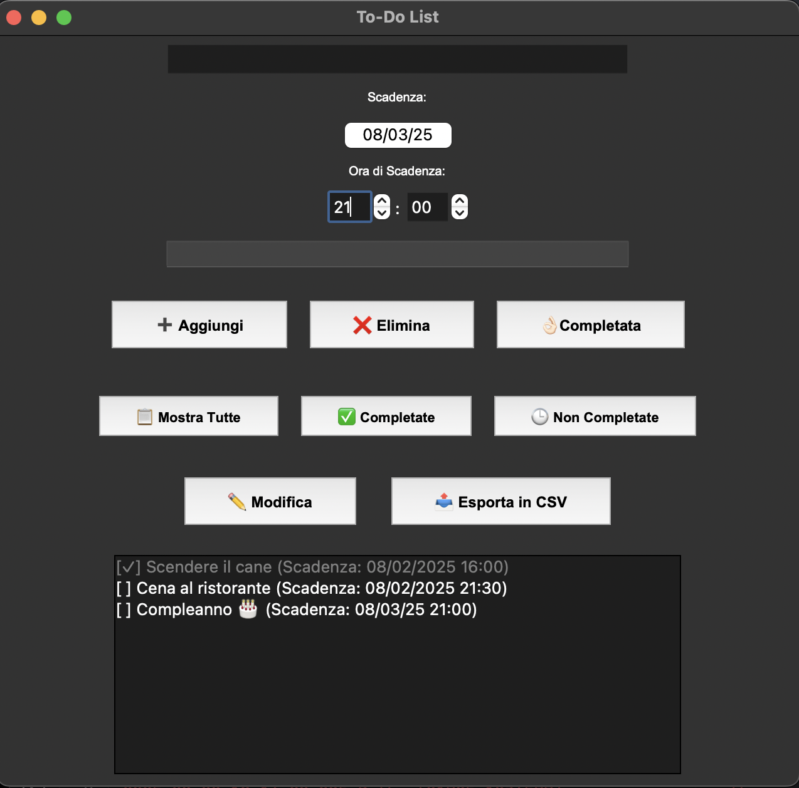

# To-Do List App in Python
To-Do List App è un’applicazione sviluppata in Python con Tkinter e SQLite che permette di gestire le attività quotidiane in modo semplice ed efficace.

Questa applicazione offre un’interfaccia intuitiva per aggiungere, modificare, completare ed eliminare attività, con la possibilità di esportare le task in CSV.

## 🚀 Funzionalità
✅ Aggiungere, modificare ed eliminare attività  
✅ Segnare attività come completate  
✅ Filtrare attività completate e non completate  
✅ Esportazione in CSV 📤  
✅ Ricerca rapida delle attività 🔎

## 🔧 Installazione
```bash
git clone https://github.com/fabriziomileto8/To_do_list.git
cd To_do_list
pip install -r requirements.txt
python main.py
```

## 🛠️ Tecnologie
- Python 3 
- Tkinter (GUI)
- SQLite (Database)
- CSV (Esportazione dati)

## 📷 Screenshot
Ecco un'anteprima dell'app:


## ✍🏻️ Autore 
Fabrizio Mileto
https://github.com/fabriziomileto8